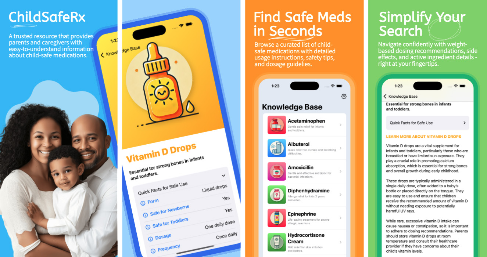
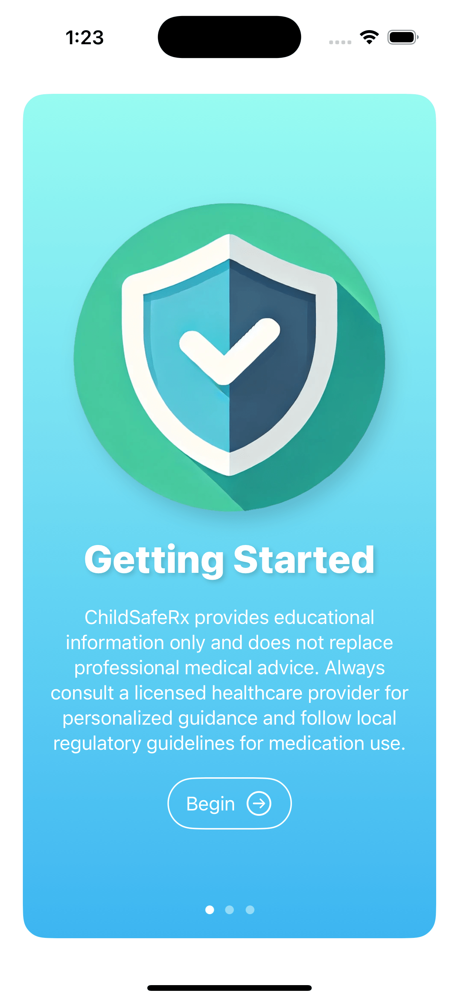
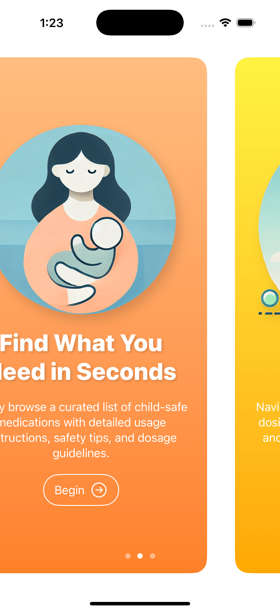
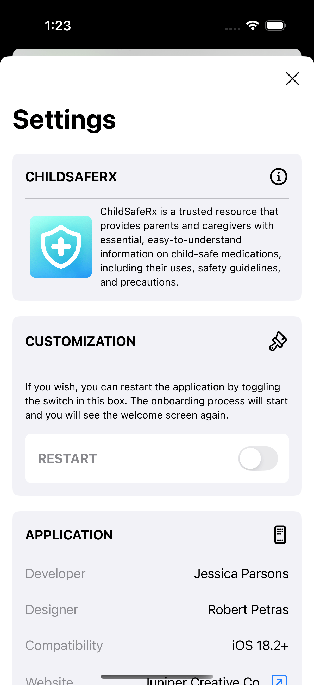

# ChildSafeRx
A trusted app for parents and caregivers, providing child-safe medication guidance and information.

## Features
- Comprehensive list of child-safe medications.
- Detailed dosage, safety guidelines, and precautions.
- Simple, intuitive UI designed for caregivers.

## Screenshots

|   |   |   |
| ------------- | ------------- | ------------- |
|  |  |  |

## Demo
| iPhone | iPad |
| ------------- | ------------- |
|  |  |

## Features
- 📱 Modern iOS Development
  - Built using SwiftUI, leveraging declarative syntax for efficient and clean UI development.
  - Designed for iOS 18, ensuring compatibility with modern app design and functionality.
- 🖌️ Dynamic User Interface
  - Multi-screen onboarding flow implemented with PageTabView for a seamless user introduction.
  - Responsive and visually engaging child-friendly interface with dynamic, data-driven content.
- 📊 Advanced Data Management
  - Dynamically loads and organizes medication information using JSON parsing.
  - Custom data model processes JSON input efficiently.
  - Leveraged Swift's Codable protocol for clean and maintainable data decoding and handling.
- 🔒 State Management
  - AppStorage used for persistent data storage, enabling smooth state-saving functionality.
  - Dynamic views that adapt to user interaction and data changes.
- 📜 Dynamic Content Display
  - Designed dynamic List Views to render child-safe medications using reusable components.
  - Scalable and modular UI architecture for future feature expansion.
- 👨‍👩‍👧 User-Centric Design
  - Prioritized accessibility with child-friendly visuals and simple navigation.
  - Clear warnings and disclaimers to promote safe and responsible usage.
- 📂 Version Control and Documentation
  - Managed the project using Git for version control and GitHub for portfolio presentation.

## Built With
- Swift 5
- SwiftUI
- Xcode 16.2
